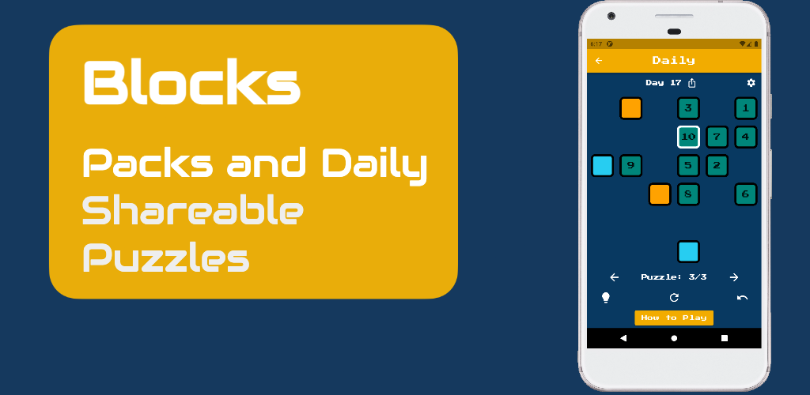

# Bayley's Blocks Challenge



[Bayley's Blocks](https://bayleysblocks.com) is a web and mobile puzzle game with daily shareable challenges. This repository provides code to generate a set of puzzles and a template function to solve them using a brute force method.

The challenge is to create a method that is more efficient than the brute force method. The template provides a way to measure the efficacy of any method by calculating the elapsed time.

## Usage

```shell
$ python3 main.py
```

## Adding Improved Method

The brute force method is located in `solver.py` and is implemented in the function `solve_puzzle()`. There is also a custom method `custom_method()` which you need to modify with your implementation.
